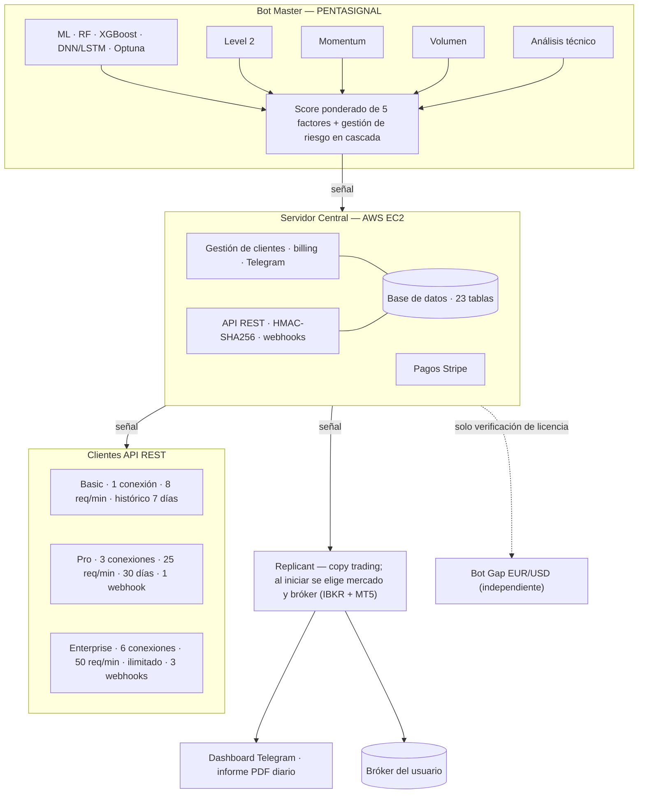

# B.E.N.D.E.R. — Sistema de Trading Algorítmico con IA

> **Banca Especializada en Negociación, Decisión y Ejecución de Resultados**
> Plataforma de trading cuantitativo de extremo a extremo: del modelo de IA a la ejecución en el bróker.

**Estado:** Funcional y desplegado en producción, operando con capital propio en fase de validación.

**Autor:** Álvaro Núñez de la Puerta — diseño, desarrollo y arquitectura en solitario.

**Url:** www.benderbot.es

---

## 🔒 Nota sobre el código

Este repositorio es un **escaparate de arquitectura**. El código fuente de B.E.N.D.E.R. es **privado y propietario**: el sistema opera con dinero real e integra secretos (claves de pago, tokens de API) y lógica sensible, por lo que no se publica de forma abierta por motivos de seguridad. Disponible para enseñar en privado (código, diagramas de flujo y demo) bajo acuerdo de confidencialidad.

---

## ¿Qué es?

B.E.N.D.E.R. es un sistema de trading algorítmico cuantitativo de extremo a extremo. Su **Bot Master** genera señales combinando cinco factores de análisis con pesos dinámicos; un servidor central las distribuye y los productos cliente las **ejecutan automáticamente en el bróker del usuario**, gestionando el riesgo en tiempo real.

Es un proyecto técnico completo: motor de inteligencia, infraestructura cloud, API REST, base de datos, integración de pagos y bots de ejecución, desarrollado íntegramente en solitario ( distribuidos en 79 módulos, además de web y API).

**Nasdaq es solo el punto de partida.** La arquitectura está diseñada desde el origen para crecer en dos ejes sin rediseñar el núcleo: **multi-mercado** (cada mercado se opera con una instancia del Bot Master adaptada por configuración) y **multi-broker** (cada bróker es un adaptador que implementa la interfaz de ejecución). El bot cliente (Replicant) ya está preparado para esa expansión.

---

## Arquitectura

Arquitectura distribuida y modular de **tres capas independientes** que se comunican por HTTP/REST seguro.

### 1. Bot Master — Motor de inteligencia ("PENTASIGNAL")

Genera la señal mediante un **score ponderado de 5 factores** con pesos dinámicos (de ahí el nombre, *PENTASIGNAL*):

- **Machine Learning** — ensemble de RandomForest, XGBoost y redes neuronales profundas (DNN/LSTM, TensorFlow/Keras), con hiperparámetros optimizados mediante **Optuna**.
- **Datos de Level 2** del mercado (profundidad de libro) en tiempo real.
- **Momentum** de mercado.
- **Análisis de volumen.**
- **Análisis técnico** (RSI, MACD, Bollinger, VWAP, Ichimoku y más de 50 indicadores).

Complementado con análisis de **sentimiento de mercado**, **calendario económico** con veto automático ante eventos macro (FOMC, CPI, NFP), correlación sectorial y filtros horarios.

**Gestión de riesgo en cascada a nivel Master:** stop-loss dinámico por ATR, control de drawdown y vetos automáticos por volatilidad (VIX) y eventos macro (Fed/BCE).

### 2. Servidor Central — Orquestación (AWS)

- Desplegado en **AWS EC2** con **Nginx (SSL/TLS)**, **Gunicorn** y CDN.
- Dos servicios independientes: gestión de clientes, notificaciones y *risk logging* por un lado; y **distribución de señales** por API por otro.
- **API REST** con autenticación **HMAC-SHA256**, **webhooks firmados** y *rate limiting* por plan.
- **Base de datos relacional** (SQLite, 23 tablas; migración a PostgreSQL planificada) compartida por servidor y API: clientes, API keys, sesiones, operaciones, señales, webhooks y controles antifraude.
- **Integración de pagos con Stripe** (modo LIVE).

### 3. Productos cliente (misma señal, varios mercados)

- **Replicant:** bot de *copy trading* con arquitectura de adaptadores ("máscaras") que permite **modo multibroker simultáneo (Interactive Brokers + MetaTrader 5)** y ampliarse a nuevos brokers y mercados sin reescribir el núcleo. Incluye **auto-actualización** con verificación de integridad (SHA256).
- **Bot Gap EUR/USD:** producto **independiente** especializado en la estrategia de *gap* del par EUR/USD. No recibe señales del sistema: opera por sí mismo y el servidor central solo verifica su licencia (*fingerprint* + pago de licencia anual). Incluye **auto-actualización** con verificación de integridad (SHA256).
- **Dashboard en tiempo real por Telegram:** consulta de P&L, posiciones y balance, notificaciones de cada operación e informes PDF diarios.
- **API REST:** acceso programático a las señales con autenticación HMAC-SHA256, *rate limiting* y webhooks push, en tres niveles de servicio:
  - **Basic** — 1 conexión simultánea · 8 req/min · histórico de 7 días.
  - **Pro** — 3 conexiones simultáneas · 25 req/min · histórico de 30 días · 1 webhook.
  - **Enterprise** — 6 conexiones simultáneas · 50 req/min · histórico ilimitado · 3 webhooks.

---

## Seguridad y antifraude

- Autenticación de API con **HMAC-SHA256** y control de sesiones simultáneas.
- **Hardware fingerprinting** (identificación de dispositivos) y vinculación de cada licencia a una cuenta de bróker concreta.
- Distinción entre cierres automáticos del sistema y operaciones manuales del usuario.

---

## Escalabilidad (Nasdaq es el principio)

El sistema está pensado para crecer **sin rediseño estructural**:

- **Eje mercados:** cada mercado nuevo se incorpora desplegando una instancia del Bot Master con sus módulos, adaptada al mercado mediante su archivo de configuración JSON (pesos y umbrales predefinidos), sin reescribir el código. Cada instancia se conecta al servidor central de AWS por un puerto dedicado y, en la evolución prevista, los Masters de los distintos mercados correrán en su propio servidor, independiente del servidor central de AWS y de los bots cliente. Nasdaq es el primero.
- **Eje brokers:** el bot cliente es único; al iniciarlo se selecciona el mercado y el bróker. IBKR y MT5 ya están activos, y MetaTrader 5 da acceso a cientos de brokers (Pepperstone, IC Markets, XM, Exness…). Cada bróker adicional amplía la cobertura sin modificar el Master ni la API.

---

## Stack tecnológico

| Área | Tecnologías |
|------|-------------|
| Lenguaje | Python 3.11 |
| Machine Learning | RandomForest · XGBoost · TensorFlow/Keras (DNN/LSTM) · scikit-learn · Optuna |
| Backend / API | Flask · Gunicorn · API REST · HMAC-SHA256 · webhooks |
| Datos | Base de datos relacional (SQLite → PostgreSQL) · multi-tenant · migraciones |
| Cloud / DevOps | AWS EC2 · Nginx · CDN · Git |
| Integraciones | Interactive Brokers (TWS API) · MetaTrader 5 · Telegram Bot API · Stripe · Level 2 |
| Desarrollo | Vibe coding (desarrollo asistido por IA) · prompt engineering · orquestación de modelos |

---

## Contacto

**Álvaro Núñez de la Puerta** — Madrid, España
📧 alvaro.n.puerta@gmail.com · linkedin.com/in/NunezPuertaAlvaro

*Disponible para enseñar el sistema en detalle (código, diagramas y demo) en conversación privada.*

